# Music Streaming Analytics

A distributed, event-driven analytics platform for real-time music play tracking.
Built to explore stream processing, distributed state management, and cloud-native deployment patterns.

## Architecture



Three microservices communicating via Kafka:

- **ingestion-service**: HTTP API for clients to report play events, publishes to Kafka
- **stream-processor**: Kafka Streams application, computes windowed aggregations (completion rate, top songs)
- **query-service**: Consumes aggregation results, serves query API backed by Redis

## Tech Stack

- **Language**: Kotlin
- **Framework**: Spring Boot 3.5
- **Stream Processing**: Kafka Streams
- **Storage**: PostgreSQL, Redis
- **Deployment**: Docker, Kubernetes (minikube for dev, GKE planned)
- **CI**: GitHub Actions

## Key Design Decisions

See [docs/decisions/](docs/decisions/) for ADRs on:
- Kafka internal topic replication under single-broker setup
- Advertised listeners and local dev loop tradeoffs
- Completion rate business definition (90% threshold)
- CQRS-style query architecture (Kafka → Redis, decoupled from stream-processor state)

## Quick Start

Prerequisites: Docker, JDK 21

```bash
# Start Kafka, PostgreSQL, Redis
docker compose -f docker-compose.dev.yml up -d

# Run each service (in separate terminals, from project root)
./gradlew :ingestion-service:bootRun
./gradlew :stream-processor:bootRun
./gradlew :query-service:bootRun

# Send test events
./scripts/test-data.sh

# Query results
curl http://localhost:8082/api/songs/song-A/completion
curl "http://localhost:8082/api/songs/top?n=5"
```

## Running on Kubernetes

Prerequisites: minikube, kubectl

```bash
# 指向 minikube 内部的 Docker daemon（每个新终端都要重新执行一次）
eval $(minikube docker-env)

# 构建三个服务镜像
docker build -t ingestion-service:v1 -f services/ingestion-service/Dockerfile .
docker build -t stream-processor:v1 -f services/stream-processor/Dockerfile .
docker build -t query-service:v1 -f services/query-service/Dockerfile .

# 部署
kubectl apply -f k8s/ingestion-service.yaml
kubectl apply -f k8s/stream-processor.yaml
kubectl apply -f k8s/query-service.yaml

kubectl get pods -w

# 本地访问
kubectl port-forward svc/ingestion-service 8080:8080 &
kubectl port-forward svc/query-service 8082:8082 &

./scripts/test-data.sh
curl http://localhost:8082/api/songs/song-A/completion
```

Kafka、PostgreSQL、Redis 通过 Helm 装在 `kafka` / `data` namespace。`docker-compose.dev.yml` 仍保留，用于不需要 K8s 的快速本地开发。

## Testing Late-arriving Events

```bash
./scripts/test-late.sh
```

Verifies that events within the grace period are correctly aggregated
into the original window, while events beyond it are dropped.

## Ports

| Service | Port |
|---|---|
| ingestion-service | 8080 |
| stream-processor | 8081 |
| query-service | 8082 |
| PostgreSQL | 5432 |
| Redis | 6379 |
| Kafka | 9092 |

## Project Status

- [x] Week 1: Core infrastructure and end-to-end pipeline
- [x] Week 2: Observability, full in-cluster K8s deployment
- [ ] Load testing, GKE deployment
