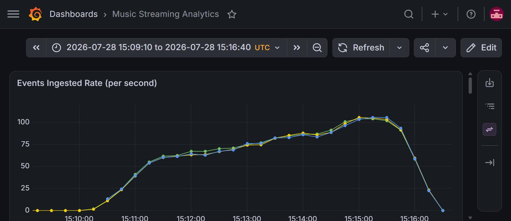
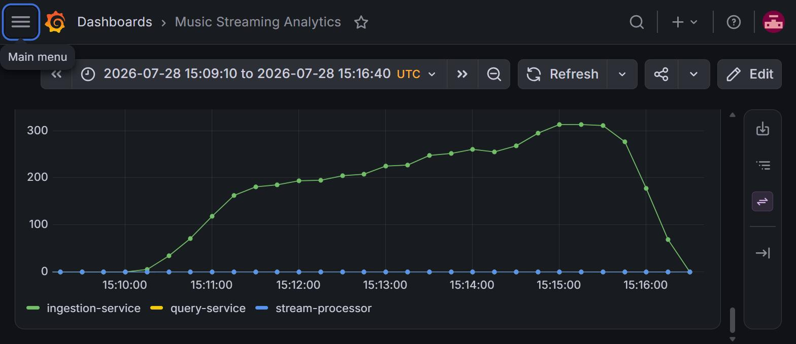
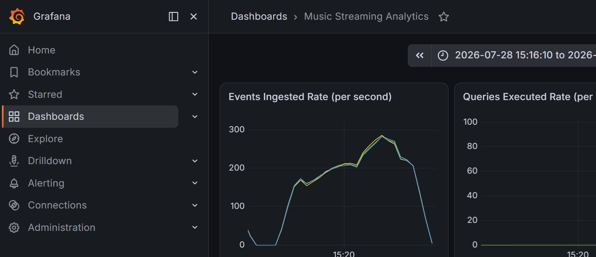
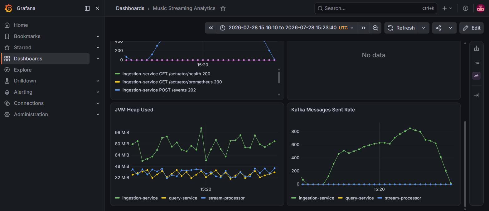
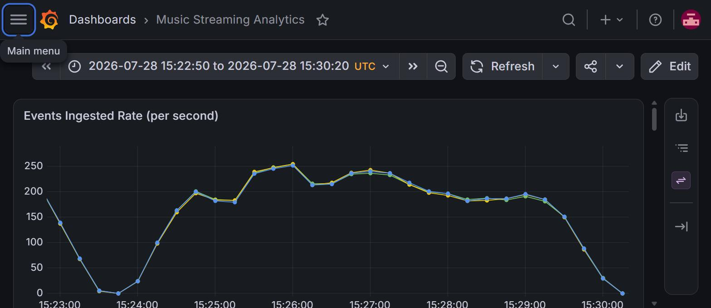
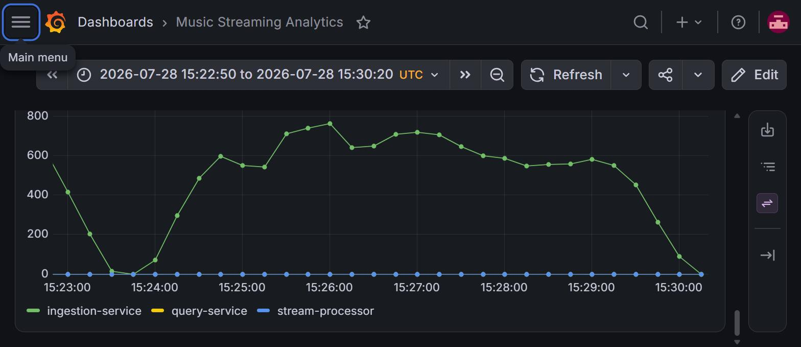
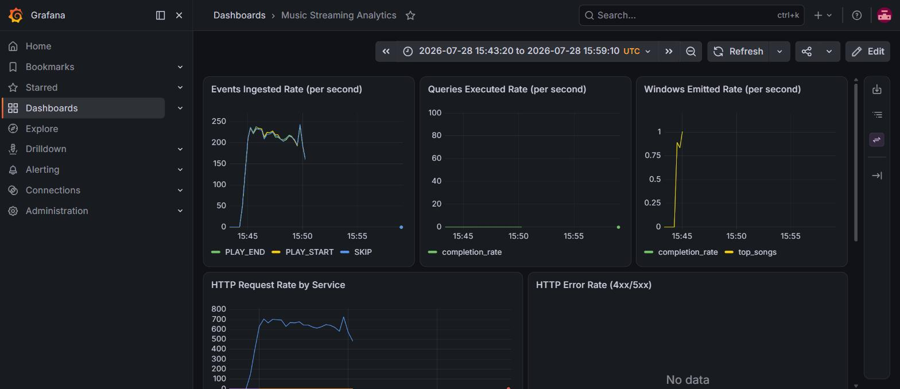
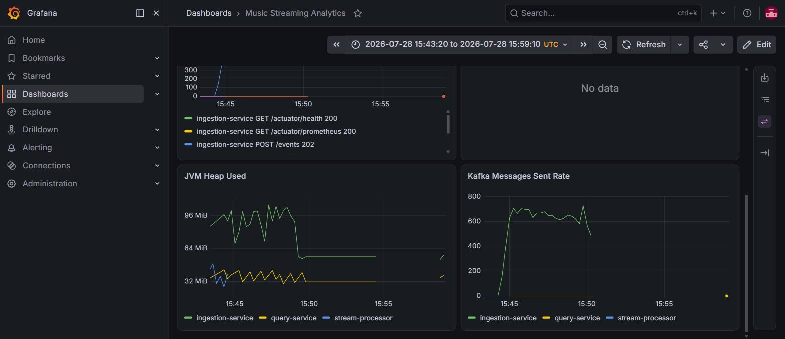
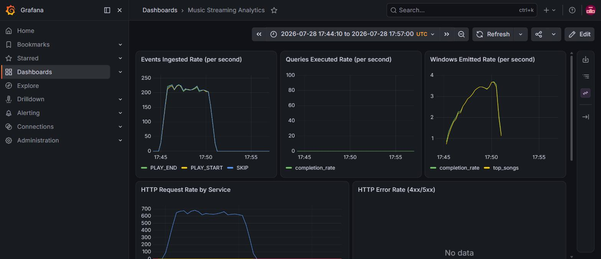
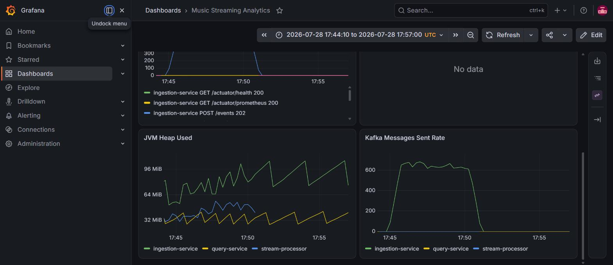

# Performance and Failure-Drill Report

> English Version. Chinese version below.

This report records the system's throughput, latency distribution, and recovery times under
load and failure conditions, and verifies three paths: scaling, failure self-healing, and
backpressure self-healing.

## Test environment

- **Cluster**: single-node minikube (local)
- **Application services** (all deployed on minikube, single replica):
  - `ingestion-service`: requests 250m CPU / 256Mi, limits 500m CPU / 512Mi
  - `stream-processor` (Kafka Streams): same specification
  - `query-service`: same specification
- **Kafka**: a single broker in the `kafka` namespace inside minikube (`kafka-controller-0`, replication factor = 1); the `play-events` topic has 6 partitions
- **Monitoring**: Prometheus and Grafana run in Docker on the host (`docker-compose.dev.yml`), with each service's `/actuator/prometheus` forwarded to the host via `kubectl port-forward` and scraped by the containerised Prometheus through `host.docker.internal`
- **Load-testing tool**: k6 v0.54.0 (static binary installed inside WSL), applying load through `kubectl port-forward svc/ingestion-service 8080:8080`
- **Load-test script**: `scripts/load-test.js`, ramping in steps to `MAX_VUS/4` and then to `MAX_VUS`, with no sleep between VU iterations (no artificial limit on the request rate of an individual VU); each run lasts 5 minutes 30 seconds

### Two preconditions for interpreting the results

**1. Environment scale.** All figures come from a single-node minikube, with k6 applying load
through a single `kubectl port-forward` connection, and cannot be used as a capacity
reference for production. The value of this report lies in its methodology and relative
trends (where saturation occurs, the order of magnitude of recovery times), not in absolute
limits.

**2. Partition skew (applies to rounds 1–3 and 5).** The load-test script used in rounds 1–3
and 5 had only 5 fixed `songId` values, and since `ingestion-service` uses `songId` as the
Kafka message key, the traffic in those rounds landed on only 2 partitions (0 and 5), with
the `LOG-END-OFFSET` of the other 4 partitions remaining 0 throughout (see the `--describe`
output in `round4-scaling.txt`). Effective consumer-side parallelism in those rounds was
therefore 2 rather than the 6 implied by the partition count, and all conclusions about
consumer throughput and backpressure from rounds 1–3 and 5 should be read with that in mind.
Round 4 regenerated the test data using `song-${__VU}-${__ITER % 300}` (300 distinct keys)
and verified that all 6 partitions carried data and that consumer-side parallelism can
indeed use all 6 paths; see round 4 below.

## Round 1: baseline (50 → 200 VUs)

| Metric | Value |
|---|---|
| Throughput | 232.1 req/s |
| Error rate | 0.00% (76,592 / 76,592 succeeded) |
| Latency p50 | 193ms |
| Latency p90 | 1.8s |
| Latency p95 | 2.19s |
| Latency max | 3.2s |
| Peak ingestion rate (Prometheus `rate()`, 1m window, summed over the three event types) | 334.8 events/s |
| ingestion-service heap | 22MB → 84MB |
| Consumer lag | 0 throughout |

Consumer lag was 0 throughout: the pressure never propagated to the Kafka consumer side, and
all latency was spent queueing HTTP requests at the ingestion layer.

**This round should not be treated as a steady-state baseline.** Round 5 used the same script
and the same `MAX_VUS=200` but reached 631.5 req/s with a p90 of 612ms — 2.7 times the
throughput and roughly a third of the p90 latency. The difference comes from this being the
first load applied that day, with the services cold: heap grew from 22MB to 84MB within the
measurement window, and JIT compilation, Kafka producer metadata retrieval, and connection
establishment all occurred inside it. The ingestion rate curve shows the same thing — this
round climbs slowly throughout with no plateau corresponding to the load steps, whereas
rounds 3 and 5 reach a plateau within 30 seconds. This round therefore reflects cold-start
behaviour, and the conclusions about the saturation point below are based on rounds 2 to 5.

Raw output: `docs/observability/perf-results/round1-baseline.txt`

## Round 2: locating the inflection point (600 → 1500 VUs)

| Max VUs | Throughput | p50 | p90 | p95 | p99 | max | Error rate | Consumer lag |
|---|---|---|---|---|---|---|---|---|
| 600 | 632.7 req/s | 401ms | 1.39s | 1.78s | 2.10s | 2.5s | 0% | 0 |
| 1500 | 619.2 req/s | 1.29s | 2.70s | 3.61s | 4.09s | 4.9s | 0% | 0 |

**Key finding**: raising concurrency from 600 to 1500 (a factor of 2.5) left throughput
essentially unchanged (in fact slightly lower) while latency degraded substantially — p99
rose from 2.10s to 4.09s. This indicates that the system is already saturated at around
**620–630 events/sec**: adding concurrency beyond that only lengthens request queueing and
does not raise the processing rate. At the same time it produces **no errors at all** (0%
failed) and **consumer lag stays at 0 throughout**.

Conclusion: the practical throughput ceiling of this configuration (single-node minikube,
single-replica ingestion at 500m CPU, a single `kubectl port-forward` connection) is around
620–630 events/sec, and the bottleneck is the HTTP handling layer of ingestion-service, not
Kafka or the Kafka Streams consumer side.

Raw output: `docs/observability/perf-results/round2-breakpoint.txt`,
`round2b-breakpoint-1500.txt`

## Round 3: failure drill — deleting the stream-processor pod

Twenty seconds into a load test (150 VUs, sustained load), the sole stream-processor replica
was deleted with `kubectl delete pod`, after which real consumer lag was polled every 3
seconds using `kafka-consumer-groups.sh --describe`. Collecting directly from Kafka rather
than through Prometheus was necessary because the port-forward broke at the moment the pod
was deleted and did not cover this window; the analysis is in ADR 007.

| Time since pod deletion | Consumer lag |
|---|---|
| 0s | 4,070 |
| 9s | 10,336 |
| 16s | 16,259 |
| 24s | 22,314 |
| 32s | 26,837 |
| **40s (peak)** | **32,467** |
| 49s | 21,251 |
| **59s** | **215** |
| after 67s | stable in the low hundreds (normal fluctuation under sustained load) |

**Conclusion**: after a single-instance failure, consumer lag peaked at roughly 32,000
messages and fell from that peak to below 1,000 (treated as caught up) **within about 60
seconds**. The Kubernetes Deployment recreated the pod automatically, and the Kafka Streams
consumer restored its internal state from the changelog topic
(`stream-processor-hourly-play-counts-changelog`, 6 partitions), with no manual intervention
and no data loss (the consumer group resumed from committed offsets).

One note on this round's throughput reading: the 255.6 req/s in the summary line of
`round3-k6-output.txt` cannot be read as a throughput figure — the wall-clock duration of
that run was stretched to 14m20s by a process-level freeze (see ADR 007, Observation 2),
distorting the denominator. Judging from the Grafana curves, the actual ingestion rate during
the load phase was around 660 events/s, consistent with the saturation values from rounds 2
and 5.

One further anomaly is recorded without a root cause: an isolated long-tail request of 8m50s
occurred within the drill window (still returning 202 and not counted as a failure). The
analysis is in ADR 007.

Raw data: `docs/observability/perf-results/round3-failure-drill-lag-trace.txt`,
`round3-k6-output.txt`

## Round 4: horizontal scaling — stream-processor to 2 replicas

```
kubectl scale deployment stream-processor --replicas=2
```

### First attempt: scaling out with empty state (insufficient key cardinality)

In the initial drill, only partitions 0 and 5 of `play-events` carried data (the result of
hashing 5 fixed `songId` values), and the Kafka Streams state store (RocksDB) held
essentially no historical state. Under those conditions, `kubectl scale` immediately
triggered a consumer group rebalance and the 6 partitions were assigned 3/3 across the two
instances:

- Existing pod (10.244.0.29): partitions 1, 3, 5
- New pod (10.244.0.31): partitions 0, 2, 4

The new pod's StreamThread started, joined the group, completed the two-phase join/sync, and
loaded the changelog within about 34 seconds of the scale-out, taking **active** tasks
directly and entering `RUNNING`. Combined with the partition skew, however, each instance
received only one partition that actually carried data (the old pod took 5, the new pod took
0), so the "3/3 split" was even only in partition count; the load being halved was a
coincidence and not evidence of the assignment strategy balancing by load.

### Second attempt: after fixing key cardinality, scaling out meets the warm-up replica mechanism

After changing the load-test script's `songId` from 5 fixed values to
`song-${__VU}-${__ITER % 300}` (300 distinct keys) and re-running,
`kafka-consumer-groups.sh --describe` confirmed that all 6 partitions carried steadily
growing data (no more permanently empty partitions). Scaling out again during the load test
produced different behaviour:

Two `--describe` snapshots at 48 and 85 seconds after the scale-out at 15:55:45 (taken at
15:56:33 and 15:57:10) both showed all 6 partitions **still handled by the original pod**,
and the new pod's log showed it had received only `New standby tasks: [0_2, 0_0]` — not
active tasks. The project code does not configure `num.standby.replicas`, so this is the
Kafka Streams default **warm-up replica mechanism** (KIP-441): when the partitions to be
migrated have already accumulated real state (in this case several hundred thousand
historical records in the RocksDB store), a new instance does not take active ownership
immediately but first warms the state up as a standby, with the actual active handover
waiting for the next **probing rebalance** (`probing.rebalance.interval.ms`, default
600000ms = 10 minutes).

Continuing to observe: the new pod completed its first join at 15:56:26 (as a standby), and a
full 10 minutes later at 16:06:26 a probing rebalance was triggered (`Request joining group
due to: group is already rebalancing` → `triggered followup rebalance scheduled for 0`),
followed by `New active tasks: [0_2, 0_0]`. `--describe` confirmed that the active consumer
for partitions 0 and 2 had switched to the new pod (10.244.0.32), with the old pod retaining
1, 3, 4, and 5 — **a 4/2 assignment this time**, unlike the 3/3 split of the first attempt
(empty state); the new instance took over only two partitions.

**This handover occurred after the load had ended.** A single k6 run lasts 5 minutes 30
seconds and the scale-out was performed at 15:55:45 (while load was in progress);
extrapolating from the growth rate of each partition between the two snapshots, the load
ended between 15:59 and 16:00, whereas the active handover occurred at 16:06:26, roughly 6 to
7 minutes later. The `--describe` at 16:11:17 showed lag of 0 on all 6 partitions with
offsets no longer advancing. That is, by the time the new instance took ownership of
partitions 0 and 2, there was no live traffic on the topic, and it never processed a single
load-test message.

What this round demonstrates is therefore that **ownership does eventually transfer
correctly**, not that the two instances shared the load. The warm-up window here was longer
than the entire load test, which is the main basis for the conclusion below.

After scaling back down to 1 replica, the old pod was deleted and the residual member
information in the consumer group was not cleared immediately — the group converges only
after the session timeout expires. Rechecking 60 seconds after scaling down, all 6 partitions
had converged back onto the remaining pod.

**Conclusion**: the horizontal scaling path itself works — changing only the replica count is
enough for Kafka Streams to reassign partitions automatically, with no code changes required.
But the claim that "a new instance shares load immediately after scaling out" holds only when
the state of the target partitions is close to empty. Once historical state has accumulated,
the default configuration leaves a warm-up period of up to 10 minutes during which the new
instance processes no live traffic and only warms state in the background. In this drill that
window was longer than the entire 5-minute-30-second load test, and the scale-out provided no
relief for that load at all. In production this window is a real cost that must be assessed in
advance. Shortening it is possible by reducing `probing.rebalance.interval.ms` (faster
handover, but more frequent rebalances and more jitter) or relaxing `acceptable.recovery.lag`
(the new instance qualifies to take over sooner, but with less current state at handover);
both are trade-offs rather than free improvements. The deployment was scaled back to 1 replica
after the drill, consistent with the configuration declared in `k8s/stream-processor.yaml`.

Raw data: `docs/observability/perf-results/round4-scaling.txt` (first attempt, empty state:
`kubectl scale` output, `--describe` before and after scaling up and down, and the new pod's
startup log) and `docs/observability/perf-results/round4-scaling-v2.txt` (second attempt,
including k6 output, multiple `--describe` snapshots around the scale-out, and the probing
rebalance timeline log).

Note: the "full topic offset spread" section at the end of `round4-scaling-v2.txt` failed —
the script used `kafka-run-class.sh kafka.tools.GetOffsetShell`, but that class moved to
`org.apache.kafka.tools.GetOffsetShell` in Kafka 4.0 and the correct invocation is
`kafka-get-offsets.sh`. The supplementary measurement (all 6 partitions carrying data,
consistent with the `LOG-END-OFFSET` from `--describe` at the same moment):

```
play-events:0:710316   play-events:1:31117   play-events:2:31296
play-events:3:30761    play-events:4:31359   play-events:5:483447
```

There are no Grafana screenshots for this round. The first attempt ran no k6 load, so the
throughput and HTTP rate panels were flat throughout. The second attempt did have real k6
load, but Prometheus scraping of stream-processor metrics depends on `kubectl port-forward
svc/stream-processor 8081:8081`, and a port-forward against a Service connects to one
specific pod rather than rotating across replicas, so per-instance panels such as JVM heap
show only one instance after the scale-out and cannot illustrate the difference between the
two. On balance, no screenshot was added.

## Round 5: real backpressure — load under CPU throttling, and self-healing

The first four rounds shared one characteristic: no matter how high the concurrency, consumer
lag stayed at 0 throughout. The reason is that the bottleneck remained at the HTTP layer of
ingestion-service (saturating at ~620 events/sec) and pressure never really reached the Kafka
consumer side — meaning none of the first four rounds verified the classic backpressure
scenario of a producer outpacing a consumer.

To cover that scenario, the stream-processor CPU limit was temporarily lowered from 500m to
100m (one fifth) and another round of 200 VU load was run (`MAX_VUS=200`, measured throughput
631.5 req/s), with real lag polled throughout using `kafka-consumer-groups.sh`:

| Time (relative to load start) | Consumer lag | Note |
|---|---|---|
| 0s | 2,905 | load begins, consumption clearly behind |
| 27s | 17,200 | still climbing |
| **79s (peak)** | **34,925** | lag peak, load still ramping |
| 106s | 27,535 | starting to fall — ramp-up ends and the 200 VU steady state begins; the throttled consumer's net throughput exceeds the steady-state production rate |
| 147s | 2,987 | |
| **161s** | **639** | first drop below 1,000 |
| **328s** | **0** | lag reaches zero |
| 342s (load ends, CPU restored to 500m) | 0 | lag stays at 0 after the CPU is restored |

**Conclusion**: with only one fifth of the CPU (100m) and a sustained load of ~630
events/sec, the consumer did experience real backpressure — lag peaked at 34,925 messages,
the highest of any round in this testing effort. The throttled consumer nonetheless retained
positive throughput, merely at a lower rate, and caught up on its own while the load
continued and the CPU remained throttled, with no manual intervention and no scaling out.

The catch-up time has two values depending on the criterion; both are given here to avoid
confusion:

- By the same criterion as round 3 (lag falling below 1,000), catching up took about
  **82 seconds** from the peak (79s → 161s);
- By the strict criterion of lag reaching exactly zero, about **4 minutes 9 seconds**
  (79s → 328s). Note that 328s already falls within k6's 30-second ramp-down (VU count begins
  falling at 300s), so the zero point overlaps with the ramp-down and this figure is
  conservative.

After restoring the CPU to 500m, observation continued for about 6 minutes (`RESTORE_TS` to
`END_TS`, 378 seconds in total); lag stayed at 0 with no rebound.

One side effect is also recorded: after the CPU was limited to 100m, the startup time of
stream-processor (Spring Boot plus Kafka Streams) lengthened significantly, the typical CFS
quota throttling amplification a JVM exhibits when starting under a very low CPU quota (the
multi-threaded burst of work during startup exhausts the quota quickly, and after throttling
it must wait for the next scheduling period, repeatedly). A follow-up controlled experiment
showed that under normal CPU (500m) startup took **31.3 seconds**, which means the earlier
claim of "a few seconds under normal conditions" does not hold; even unthrottled it is on the
order of 30 seconds. Under the 100m limit, an environment-level stall of roughly 10 minutes
occurred during measurement (the same class of WSL2/host process stall recorded in ADR 007,
Observation 2), which left the two internal timings reported by Spring Boot contradicting each
other — `Started in 764.151 seconds` alongside `process running for 196.048` on the same line.
Startup time cannot semantically exceed the JVM's lifetime, so at least one clock was
contaminated. **No credible amplification factor can therefore be given for this run**; only
the qualitative conclusion holds: throttling stretched startup from the 30-second scale to the
order of minutes. The 181 seconds recorded earlier is of the same order as the smaller of the
two readings, which corroborates that the amplification is real, but a precise factor requires
re-measurement without environmental stalls. This also shows that the Kubernetes `Ready` state
was unreliable in this scenario: none of the three Deployments had a `readinessProbe`, so a
pod was marked Ready as soon as the container process started, while the Spring Boot
application still needed considerably longer (on the order of 30 seconds normally, several
minutes when throttled) before it could actually serve requests. **A `readinessProbe` against
`/actuator/health` has now been added to all three Deployments and measured before and after
with the same drill**: before the fix, Kubernetes judged the new pod `Ready` 3 seconds after
`kubectl delete pod` while the application did not finish starting for another 34 seconds,
producing a 34-second false-Ready window; after the fix, the new pod remained `0/1 Not Ready`
from deletion until turning `1/1` at `t+32`, consistent with the application's actual
readiness (`t+27.8s`) and with the first probe that could succeed as derived from the probe
parameters (`t+28`). See ADR 007, Observation 3.

Raw data: `docs/observability/perf-results/round5-backpressure-lag-trace.txt`,
`round5-k6-output.txt`; the startup-time controlled experiment (full logs of both the normal
and throttled startups, the polling record, and notes on data quality) is in
`round5-startup-timing.txt`.

## Conclusions

On single-node minikube with single replicas at 500m CPU:

- **Throughput**: the system saturates at around 620 events/sec, with p99 latency below 2.1s
  before saturation and a zero error rate throughout; the bottleneck is the HTTP handling
  layer of ingestion-service.
- **Failure recovery**: after deleting the single stream-processor instance, the Kafka Streams
  consumer restored state automatically from the changelog; consumer lag peaked at 32,000
  messages and returned to normal within about 60 seconds, with no data loss.
- **Backpressure recovery**: limiting consumer compute to one fifth to create real
  backpressure produced a lag peak of 35,000 messages; with the load continuing and no manual
  intervention, the consumer caught up in about 82 seconds by the round 3 criterion, and lag
  reached exactly zero in about 4 minutes 9 seconds.
- **Horizontal scaling**: changing the replica count alone is enough for partitions to be
  reassigned, with no code changes; but if the target partitions already hold real historical
  state, the default configuration requires a warm-up replica cycle of up to 10 minutes before
  a new instance begins sharing load — scaling out is not effective immediately.

## Screenshots

Grafana dashboard "Music Streaming Analytics", screenshots for the time window of each round
(all timelines in UTC):

**Round 1: baseline**




The panel shows three series by event type, each peaking at about 105 events/s; their sum is
the 334.8 events/s in the table. The curve climbs slowly throughout with no plateau
corresponding to the load steps, which is one basis for judging this round to be in a
cold-start state.

**Round 2: 600 VUs**




**Round 2: 1500 VUs** (peak ingestion rate is lower than at 600 VUs, confirming saturation)




**Round 3: failure drill** (throughput drops sharply and flattens at ~15:50, corresponding to
the normal end of the k6 load phase and the start of the anomalous long-tail request; see
ADR 007)




The stream-processor curve in the JVM panel disappears after 15:45, exactly the phenomenon
described in ADR 007, Observation 1: once the pod was deleted, the `port-forward` pipe died
and Prometheus could no longer scrape metrics from the new pod.

**Round 5: real backpressure (stream-processor CPU throttled to 100m)** (the throughput curve
drops sharply and flattens at ~17:50, corresponding to the end of the k6 load phase)




The shape of the stream-processor heap curve during the load phase matches the other rounds
with no sign of memory pressure, indicating that the bottleneck in this round was CPU rather
than memory. It should be noted that the curve covers only the short span 17:47–17:51 —
restoring the CPU quota triggered pod recreation, which broke the `port-forward`, so the
observation window behind this judgement is limited.

Note: this dashboard has no consumer lag panel, so the "lag rises then falls" data from the
failure drill and the backpressure test comes from polling `kafka-consumer-groups.sh` directly
(see the round 3 and round 5 tables) and does not appear in these screenshots.

---

# 性能压测与故障演练报告

本报告记录系统在压力与故障条件下的吞吐、延迟分布和恢复时间，并验证扩展、故障自愈、背压自愈三条路径是否成立。

## 测试环境

- **集群**：minikube 单节点（本地）
- **业务服务**（均部署在 minikube，单副本）：
  - `ingestion-service`：requests 250m CPU / 256Mi，limits 500m CPU / 512Mi
  - `stream-processor`（Kafka Streams）：同规格
  - `query-service`：同规格
- **Kafka**：minikube 内 `kafka` namespace 下单 broker（`kafka-controller-0`，replication factor = 1）；`play-events` topic 6 个 partition
- **监控**：Prometheus + Grafana 跑在宿主机 Docker（`docker-compose.dev.yml`），通过 `kubectl port-forward` 把各服务的 `/actuator/prometheus` 转发到宿主机，再由容器内 Prometheus 经 `host.docker.internal` 抓取
- **压测工具**：k6 v0.54.0（WSL 内静态二进制安装），通过 `kubectl port-forward svc/ingestion-service 8080:8080` 施加负载
- **压测脚本**：`scripts/load-test.js`，阶梯式爬升到 `MAX_VUS/4` 再到 `MAX_VUS`，VU 之间不插入 sleep（不人为限制单个 VU 的请求速率）；单次运行时长 5 分 30 秒

### 结果解读的两个前提

**一、环境规模。** 所有数字都取自 minikube 单节点，且 k6 经由 `kubectl port-forward` 的单条连接施加负载，不能作为生产环境的容量参考。本报告的价值在于方法论与相对趋势（饱和点位置、恢复时间量级），而非绝对上限。

**二、分区倾斜（第一至三、五轮适用）。** 第一至三、五轮使用的压测脚本只有 5 个固定 `songId`，而 `ingestion-service` 以 `songId` 作为 Kafka 消息 key，因此这几轮的流量实际只落在 2 个 partition（0 与 5）上，其余 4 个 partition 的 `LOG-END-OFFSET` 始终为 0（见 `round4-scaling.txt` 的 `--describe` 输出）。这意味着这几轮消费侧的有效并行度是 2，而不是 partition 数所暗示的 6，第一至三、五轮所有关于消费端吞吐和背压的结论都应在这个前提下理解。第四轮已改用 `song-${__VU}-${__ITER % 300}` 重新生成压测数据（300 个不同 key），验证了 6 个 partition 均有数据、消费侧并行度确实能用满 6 路，见下文第四轮。

## 第一轮：基线（50 → 200 并发）

| 指标 | 数值 |
|---|---|
| 吞吐 | 232.1 req/s |
| 错误率 | 0.00%（76,592 / 76,592 成功） |
| 延迟 p50 | 193ms |
| 延迟 p90 | 1.8s |
| 延迟 p95 | 2.19s |
| 延迟 max | 3.2s |
| 摄入速率峰值（Prometheus `rate()`，1m 窗口，三类事件求和） | 334.8 events/s |
| ingestion-service 堆内存 | 22MB → 84MB |
| consumer lag | 全程 0 |

consumer lag 全程为 0，压力没有传导到 Kafka 消费端；延迟全部消耗在 ingestion 这一层的 HTTP 请求排队上。

**这一轮不宜作为稳态基线。** 第五轮使用同一份脚本、同样的 `MAX_VUS=200`，吞吐却是 631.5 req/s、p90 为 612ms——吞吐差 2.7 倍，p90 延迟差约 3 倍。差异的来源是本轮为当天第一次施压，服务处于冷启动状态：堆内存在测试窗口内从 22MB 一路增长到 84MB，JIT 编译、Kafka producer 元数据获取、连接建立都发生在测量区间内。从摄入速率曲线也能看出这一点——本轮是全程缓慢爬升、看不到负载阶梯对应的平台期，而第三、第五轮在 30 秒内即进入平台期。因此本轮反映的是冷启动状态下的表现，后文关于饱和点的结论以第二至第五轮为准。

原始输出：`docs/observability/perf-results/round1-baseline.txt`

## 第二轮：找拐点（600 → 1500 并发）

| 并发上限 | 吞吐 | p50 | p90 | p95 | p99 | max | 错误率 | consumer lag |
|---|---|---|---|---|---|---|---|---|
| 600 | 632.7 req/s | 401ms | 1.39s | 1.78s | 2.10s | 2.5s | 0% | 0 |
| 1500 | 619.2 req/s | 1.29s | 2.70s | 3.61s | 4.09s | 4.9s | 0% | 0 |

**关键发现**：并发从 600 加到 1500（2.5 倍），吞吐几乎不变（甚至略降），但延迟大幅恶化——p99 从 2.10s 涨到 4.09s。这说明系统在 **~620–630 events/sec** 附近已经饱和：继续增加并发只会延长请求排队时间，不会提高处理速率；但同时也**不产生任何错误**（0% failed），且 **consumer lag 全程为 0**。

结论：这套 minikube 单节点配置（500m CPU 单副本 ingestion + `kubectl port-forward` 单连接链路）的实际吞吐上限在 ~620–630 events/sec，瓶颈在 ingestion-service 的 HTTP 处理层，而不是 Kafka / Kafka Streams 消费端。

原始输出：`docs/observability/perf-results/round2-breakpoint.txt`、`round2b-breakpoint-1500.txt`

## 第三轮：故障演练——删除 stream-processor pod

压测（150 并发持续负载）进行到第 20 秒时，用 `kubectl delete pod` 删除 stream-processor 的唯一副本，随后每 3 秒用 `kafka-consumer-groups.sh --describe` 轮询真实 consumer lag。改用直连 Kafka 采集而非 Prometheus，是因为 port-forward 在 pod 被删除时同时断开、没能覆盖这段窗口，原因分析见 ADR 007。

| 删除 pod 后经过的时间 | consumer lag |
|---|---|
| 0s | 4,070 |
| 9s | 10,336 |
| 16s | 16,259 |
| 24s | 22,314 |
| 32s | 26,837 |
| **40s（峰值）** | **32,467** |
| 49s | 21,251 |
| **59s** | **215** |
| 67s 之后 | 稳定在几百量级（持续负载下的正常波动） |

**结论**：单实例故障后，consumer lag 峰值约 3.2 万条，**约 60 秒内**从峰值回落到 1,000 以下（视为追平）。K8s Deployment 自动重建 pod，Kafka Streams 消费者从 changelog topic 恢复内部状态（`stream-processor-hourly-play-counts-changelog`，6 partition），无需人工介入，无数据丢失（consumer group 基于已提交 offset 继续消费）。

关于本轮的吞吐读数需要说明：`round3-k6-output.txt` 汇总行给出的 255.6 req/s 不能当作吞吐指标读取——该次运行的墙钟时长被一次进程级冻结拉长到 14m20s（详见 ADR 007 Observation 2），分母失真。从 Grafana 曲线看，负载阶段的实际摄入速率在 660 events/s 上下，与第二、第五轮的饱和值一致。

另外记录一个尚未定位根因的异常：演练窗口内出现一次 8m50s 的孤立长尾请求（仍返回 202，未计入失败率）。分析与记录见 ADR 007。

原始数据：`docs/observability/perf-results/round3-failure-drill-lag-trace.txt`、`round3-k6-output.txt`

## 第四轮：水平扩展——stream-processor 扩到 2 副本

```
kubectl scale deployment stream-processor --replicas=2
```

### 第一次尝试：空状态下的扩容（键基数不足）

初次演练时，`play-events` 只有 partition 0 和 5 有数据（5 个固定 `songId` 散列的结果），Kafka Streams 状态存储（RocksDB）里也基本没有历史状态。此时 `kubectl scale` 后 Kafka 立即触发 consumer group rebalance，6 个 partition 按 3/3 分配给两个实例：

- 原有 Pod（10.244.0.29）：partition 1, 3, 5
- 新增 Pod（10.244.0.31）：partition 0, 2, 4

新 pod 的 StreamThread 在扩容后约 34 秒内完成启动、加入 group、两阶段 join/sync、加载 changelog，直接拿到 **active** task 并转入 `RUNNING`。但结合分区倾斜，两个实例各自只拿到一个真正有数据的 partition（旧 pod 拿 5、新 pod 拿 0），"3/3 均分"只是分区数量上均匀，负载对半分是巧合，不代表分配策略在按负载均衡。

### 第二次尝试：修复键基数后，扩容遇到 warm-up replica 机制

把压测脚本的 `songId` 从 5 个固定值改成 `song-${__VU}-${__ITER % 300}`（300 个不同 key）后重新压测，`kafka-consumer-groups.sh --describe` 确认 6 个 partition 全部有数据在稳定增长（不再有 4 个恒为 0 的分区），压测期间再执行一次扩容，这次观察到了不同的行为：

扩容（15:55:45）后 48 秒和 85 秒两次 `--describe`（15:56:33、15:57:10）都显示 6 个 partition **仍然全部由原 pod 处理**，新 pod 的日志显示它只拿到了 `New standby tasks: [0_2, 0_0]`——不是 active task。项目代码里没有配置 `num.standby.replicas`，这是 Kafka Streams 的默认 **warm-up replica 机制**（KIP-441）：当待迁移的 partition 已经积累了实际状态（这次 RocksDB store 里有几十万条历史记录），新实例不会立刻拿到 active 所有权，而是先以 standby 身份预热状态，真正的 active 切换要等下一次 **probing rebalance**（`probing.rebalance.interval.ms`，默认 600000ms = 10 分钟）。

继续等待验证：新 pod 于 15:56:26 完成首次 join（此时是 standby），整整 10 分钟后的 16:06:26 触发 probing rebalance（`Request joining group due to: group is already rebalancing` → `triggered followup rebalance scheduled for 0`），随后 `New active tasks: [0_2, 0_0]`，`--describe` 确认 partition 0、2 的 active 消费者切换为新 pod（10.244.0.32），旧 pod 保留 1、3、4、5——**这次是 4/2 分配**，与第一次尝试（空状态）的 3/3 均分不同，新实例只接管了两个 partition。

**这次切换发生在负载结束之后。** k6 单次运行 5 分 30 秒，扩容执行于 15:55:45（负载进行中）；按各 partition 在两次快照之间的增长速率反推，负载在 15:59 至 16:00 之间结束，而 active 切换发生在 16:06:26，晚于负载结束约 6 至 7 分钟。16:11:17 的 `--describe` 显示 6 个 partition 的 lag 均为 0、offset 不再推进。即新实例取得 partition 0、2 的所有权时，topic 上已无实时流量，其全程未处理过任何一条压测消息。

因此本轮可以证明的是**所有权最终会正确转移**，而非两个实例分担了负载。本次的 warm-up 窗口长于整场压测，这一点构成下文结论的主要依据。

缩容回 1 副本后，旧 pod 被删除，consumer group 里残留的成员信息不会立刻清除——需要等 session timeout 过期后 group 才收敛。本次缩容 60 秒后复查，6 个 partition 已全部收敛回剩下的那个 pod。

**结论**：水平扩展路径本身可行——只改 replica 数，Kafka Streams 的 partition 分配自动完成，不需要额外代码改动。但"扩容后新实例立即分担负载"这一说法，仅在目标 partition 的状态接近空时成立；一旦已有历史状态积累，默认配置下扩容存在长达 10 分钟的 warm-up 期，新实例在此期间不处理实时流量，仅在后台预热状态。本次演练中该窗口长于整场 5 分 30 秒的压测，扩容对当次负载未产生任何缓解作用。这一窗口在生产环境属于需要预先评估的真实代价；若要缩短，可调小 `probing.rebalance.interval.ms`（切换更快，但 rebalance 更频繁、抖动增加），或放宽 `acceptable.recovery.lag`（新实例更早被判定为可接管，但接管时状态的新鲜度下降），两者均为权衡而非无代价的改进。演练后已缩回 1 副本，与 `k8s/stream-processor.yaml` 中声明的配置保持一致。

原始数据：`docs/observability/perf-results/round4-scaling.txt`（第一次尝试，空状态，`kubectl scale` 命令输出、扩容/缩容前后的 `--describe`、新 pod 启动日志）、`docs/observability/perf-results/round4-scaling-v2.txt`（第二次尝试，含 k6 输出、扩容前后多次 `--describe` 快照、probing rebalance 时间线日志）。

注：`round4-scaling-v2.txt` 末尾的 "full topic offset spread" 一节是失败的——脚本用了 `kafka-run-class.sh kafka.tools.GetOffsetShell`，该类在 Kafka 4.0 已迁移到 `org.apache.kafka.tools.GetOffsetShell`，正确的调用方式是 `kafka-get-offsets.sh`。补测结果（6 个 partition 均有数据，与同一时刻 `--describe` 的 `LOG-END-OFFSET` 一致）：

```
play-events:0:710316   play-events:1:31117   play-events:2:31296
play-events:3:30761    play-events:4:31359   play-events:5:483447
```

本轮没有 Grafana 截图：第一次尝试没有跑 k6 负载，吞吐/HTTP 速率类面板全程是平的；第二次尝试虽然有真实 k6 负载，但 Prometheus 抓取 stream-processor 指标依赖 `kubectl port-forward svc/stream-processor 8081:8081`，而 port-forward 面向 Service 时只会连到其中一个具体 pod、不会在多副本间轮询，扩容后 JVM heap 这类按实例展示的面板也只能看到一个实例，看不出双实例的差异，权衡后仍然没有专门补一张。

## 第五轮：真实背压——CPU 限流下的负载与自愈

前四轮压测有一个共同现象：无论并发加到多高，consumer lag 全程为 0。原因是瓶颈始终停在 ingestion-service 的 HTTP 层（~620 events/sec 即饱和），压力没有真正传导到 Kafka 消费端——也就是说，前四轮都没有验证过"生产者快于消费者"这一经典背压场景。

为补上这个场景，把 stream-processor 的 CPU limit 从 500m 临时降到 100m（降到原来的 1/5），再跑一轮 200 并发负载（`MAX_VUS=200`，实测吞吐 631.5 req/s），全程用 `kafka-consumer-groups.sh` 轮询真实 lag：

| 时间点（相对负载开始） | consumer lag | 说明 |
|---|---|---|
| 0s | 2,905 | 负载开始，消费明显跟不上 |
| 27s | 17,200 | 持续攀升 |
| **79s（峰值）** | **34,925** | lag 峰值，此时负载仍在爬坡 |
| 106s | 27,535 | 开始回落——负载爬坡结束，进入 200 并发稳态，节流后的消费者净吞吐 > 稳态生产速率 |
| 147s | 2,987 | |
| **161s** | **639** | 首次回落到 1,000 以下 |
| **328s** | **0** | lag 归零 |
| 342s（负载结束，恢复 CPU 到 500m） | 0 | 恢复 CPU 后 lag 保持 0 |

**结论**：consumer 在只有 1/5 CPU（100m）的情况下，面对 ~630 events/sec 的持续负载，确实形成了真实的背压——lag 峰值达到 3.49 万条，是本次所有压测中最高的一次。但节流后的消费者仍有正吞吐，只是速度更慢，并且在负载未停、CPU 未恢复的情况下自行追平，不需要人工介入或扩容。

追平耗时按口径不同有两个数字，此处并列给出以免混淆：

- 按与第三轮一致的口径（lag 回落到 1,000 以下），从峰值到追平约 **82 秒**（79s → 161s）；
- 若以 lag 严格归零为准，则约 **4 分 9 秒**（79s → 328s）。需要注意 328s 已进入 k6 的 30 秒降载阶段（第 300 秒起 VU 数开始回落），归零与降载在时间上重叠，因此这个数字偏保守。

恢复 CPU 到 500m 之后继续观察约 6 分钟（`RESTORE_TS` 至 `END_TS`，共 378 秒），lag 保持 0，未出现反弹。

另外记录一个副作用：CPU 限到 100m 后，stream-processor（Spring Boot + Kafka Streams）的启动时间被显著拉长，这是 JVM 在极低 CPU 配额下启动时典型的 CFS quota 节流放大效应（启动阶段的多线程突发请求迅速耗尽配额，被限流后要等到下一个调度周期，如此反复）。补做的对照实验显示：正常 CPU（500m）下启动耗时 **31.3 秒**，说明原先"正常几秒钟"的表述不成立，即使不限流也在 30 秒量级。限流到 100m 后，测量过程中出现了一次约 10 分钟的环境级卡顿（与 ADR 007 Observation 2 记录的 WSL2/宿主机进程卡顿属同一类），Spring Boot 自报的两个内部计时因此相互矛盾——`Started in 764.151 seconds`，而同一行的 `process running for 196.048`；启动耗时在语义上不可能超过 JVM 存活时长，说明至少有一个时钟已被污染。**因此本次无法给出可信的放大倍数**，仅能确认定性结论：限流后启动耗时由 30 秒量级延长至分钟量级。原先记录的 181 秒与本次两个读数中较小者量级相当，可佐证放大效应真实存在，但精确倍数需在无环境卡顿的条件下重新测量。这也说明 K8s 的 `Ready` 状态在这个场景下不可靠：三个 Deployment 原先都没有配置 `readinessProbe`，容器进程一启动就被标记 Ready，但 Spring Boot 应用实际上还要再等（正常也要 30 秒量级，限流时数分钟）才真正能处理请求。**`readinessProbe`（探测 `/actuator/health`）现已为三个 Deployment 补齐，并以同一演练做了前后对照实测**：修复前，`kubectl delete pod` 后 K8s 在 3 秒即判定新 pod `Ready`，而应用 34 秒后才启动完成，构成一个 34 秒的"假 Ready"窗口；修复后，新 pod 自删除起始终为 `0/1 Not Ready`，至 `t+32` 转为 `1/1`，与应用实际就绪时刻（`t+27.8s`）及按探针参数推算的首个可成功探测时刻（`t+28`）一致。详见 ADR 007 Observation 3。

原始数据：`docs/observability/perf-results/round5-backpressure-lag-trace.txt`、`round5-k6-output.txt`；启动耗时对照实验（正常/限流两次启动的完整日志、轮询记录、数据质量说明）见 `round5-startup-timing.txt`。

## 结论

在 minikube 单节点、单副本（500m CPU）配置下：

- **吞吐**：系统在 ~620 events/sec 附近饱和，饱和前 p99 延迟低于 2.1s，全程零错误率；瓶颈位于 ingestion-service 的 HTTP 处理层。
- **故障恢复**：删除 stream-processor 单实例后，Kafka Streams 消费者基于 changelog 自动恢复状态，consumer lag 峰值 3.2 万条，约 60 秒内恢复至正常水平，无数据丢失。
- **背压恢复**：将消费者算力限制到 1/5 以制造真实背压，lag 峰值 3.5 万条；在负载不停、无任何人工干预的条件下，消费者按第三轮口径约 82 秒追平，lag 完全归零约 4 分 9 秒。
- **水平扩展**：仅调整 replica 数即可完成 partition 重新分配，无需代码改动；但目标 partition 若已有真实历史状态，默认配置下新实例要等最多 10 分钟的 warm-up replica 周期才会真正开始分担负载，并非扩容即时生效。

## 截图

Grafana dashboard「Music Streaming Analytics」，各轮对应时间窗口截图（时间轴均为 UTC）：

**第一轮：基线**


面板按事件类型分三条序列展示，单条峰值约 105 events/s，三条求和即表中的 334.8 events/s。曲线全程缓慢爬升、没有出现负载阶梯对应的平台期，是前文判断本轮处于冷启动状态的依据之一。

**第二轮：600 并发**


**第二轮：1500 并发**（摄入速率峰值反而低于 600 并发，印证饱和结论）


**第三轮：故障演练**（~15:50 处吞吐骤降转平，对应 k6 压测阶段正常结束、进入那次异常长尾请求的时间点，详见 ADR 007）


JVM 面板中 stream-processor 的曲线在 15:45 之后消失，正是 ADR 007 Observation 1 描述的现象：pod 被删除后 `port-forward` 管道失效，Prometheus 再也抓不到新 pod 的指标。

**第五轮：真实背压（stream-processor CPU 限流到 100m）**（吞吐曲线在 ~17:50 骤降转平，对应 k6 负载阶段结束）


stream-processor 的堆内存曲线在负载期间形状与其他轮次一致，没有出现内存压力的迹象，说明本轮瓶颈来自 CPU 算力而非内存。需要说明的是该曲线只覆盖 17:47–17:51 这一小段——恢复 CPU 配额触发了 pod 重建，`port-forward` 随之断开，因此这一判断的观测窗口有限。

说明：该 dashboard 没有建 consumer lag 面板，所以故障演练和背压测试中"lag 先涨后落"的曲线数据都来自直接轮询 `kafka-consumer-groups.sh`（见第三轮、第五轮表格），不在这几张截图里。
